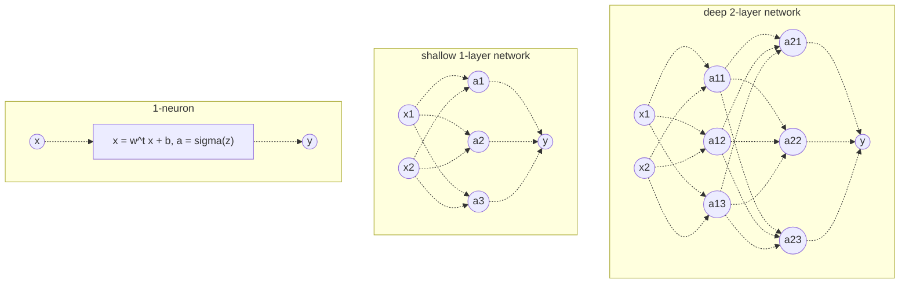
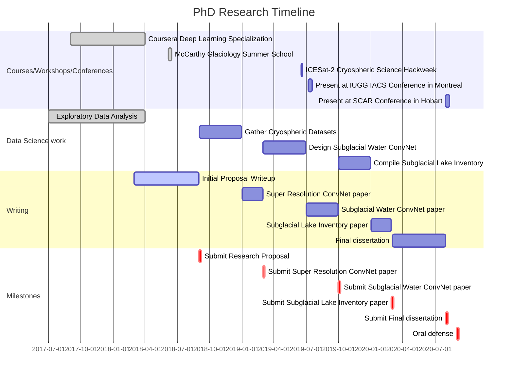

\newpage
# Topic Development

## Background

Glaciers flow via a combination of three processes: 1) plastic deformation of the viscous ice itself; 2) sliding at the glacier bed; and 3) deformation of the bed [see Figure 1, @Cuffeyphysicsglaciers2010, p.223].
Of these 3 processes, those occuring at and below the glacier bed are the least understood and prone to change.
Also, basal sliding and bed deformation are not mutually exclusive processes, but controlled in some way by the amount of water in the subglacial part of the glacier [@Cuffeyphysicsglaciers2010, p.223].

{width=375px}

Taken together, the motion of glaciers from sliding and deformation at the bed is also termed basal slip [@Cuffeyphysicsglaciers2010, p.223].
The amount of water available plays an important role in increasing or decreasing basal slip.
In mountain glaciers, it has been observed that glaciers flow faster during the spring melt season and ocassionally after heavy rainfall [@IkenUpliftUnteraargletscherBeginning1983].
Similarly in Antarctica, ice streams are often observed to overly subglacial lakes - large water bodies that drain ocassionally and trigger rapid ice flow events [@BellLargesubglaciallakes2007].

Subglacial water helps ice to flow faster by exerting an upward pressure that locally reduces the downward pressure of the ice.
This effect is greater where drainage is poor, in small channel cavities on the lee side of bedrock bumps.
When more water is forced into the cavity than can drain away, pressure will build up and increase the area of separation between ice and rock, thus lowering friction and allowing ice to slide over its bedrock [@Cuffeyphysicsglaciers2010, p.238].
Water can also percolate into porous bedrock and weaken it into a softer material more prone to deformation.
In fact, most glacier beds are composed of glacial till.
When these highly porous sediments are saturated with water, they can easily give way and deform, carrrying along with it the overlying ice [@Cuffeyphysicsglaciers2010, p.255-256].
Given enough information on the basal velocity, shear stress, and properties of the bedrock, it should be possible to formulate a slip relation that can predict the movement of a glacier [@Cuffeyphysicsglaciers2010, p.223].

To obtain better constraints on the distribution of water at the bed of glaciers and ice sheets, this study proposes a deep learning approach that can effectively scan through multiple remote sensing datasets and highlight features of interest.
Better determining how water behaves at the glacier bed should inform two major outstanding problems in glaciology: the detailed mechanisms of basal slip; and the causes and mechanisms of glacial surges [@Cuffeyphysicsglaciers2010, p.176].
This will help inform how fast the ice draining from glaciers and ice sheets will flow as our planet continues to warm.
Consequently, this feeds into the bigger picture question: "What is the rate at which sea level will rise and affect our coastal communities around the globe?"

## Previous work

### Glacier flow in relation to basal water

In Antarctica, water can be easily seen on the surface in some places, mostly close to dark, low-albedo areas like rock outcrops and blue ice regions [@KingslakeWidespreadmovementmeltwater2017].
The bulk of liquid water in Antarctica however, lies hidden below the ice sheet.
There are over 400 subglacial lakes discovered, and we know from geomophological evidence that water flows in subglacial channels underneath the ice sheet [@SiegertRecentadvancesunderstanding2016].
Water in the cryospheric system is interesting primarily because of its fluid properties.
Compared to ice, water flows a lot more quickly over short timescales, and ice that is in contact with water is more dynamic than it would otherwise be.

Various subglacial drainage pathways have been theorized over the years, ranging from fast channelized flow to slower distributed flows over a large surface area [see Figure 2, @FlowersModellingwaterflow2015].
These subglacial drainage structures are known to change between the two extremes of efficient and inefficient regimes over space and time, with implications for ice dynamics [@MullerVelocityfluctuationswater1973].
The treatment of Antarctic glaciers/ice streams does however, differ from that of temperate glaciers owing to the lack of input from surface meltwater, i.e. the Antarctic subglacial water system is predominantly supplied from basal melt processes.
One area of initial heavy focus was on the Whillans Ice Stream (formerly Ice Stream B), where seismic surveys found a water saturated, ~5 metre thick porous till layer [@BlankenshipSeismicmeasurementsreveal1986] that could easily deform and explain the observed high surface velocities [@AlleyDeformationtillice1986].
Indeed, further studies in other geographic locations found that soft beds and abundant meltwater are one of the major controls on the locations of ice streams, secondary only to topographic focusing linked to a calving margin [@WinsborrowWhatcontrolslocation2010].
This reinforces the importance of water as a driver of fast ice flow, and underlines the importance of knowing the location of water beneath the ice sheet.

{width=450px}

The most exemplary example of fast glacier flow are when glaciers *surge*, characterized by an "abnormally fast flow of a glacier over a period of a few months to years, during which the glacier margin may advance substantially" [@CogleyGlossaryglaciermass2011, p.89].
Recurring surge events are well documented in several small glaciers, the classical example being Variegated Glacier in Alaska [@EisenVariegatedGlacierAlaska2005].
There has been little evidence however, for surges happening across broad regions of modern ice sheets [@Cuffeyphysicsglaciers2010, p.537].
Isolated surge-type glaciers are found in some parts of East Greenland, initially considered to mostly exhibit Alaskan-type surges based on a hydrologic switch model [@JiskootSurgepotentialdrainagebasin2003].
Later studies have shown that Svalbard-type surges based on a thermal switch model also apply to some glaciers in the region [@JiskootSurgesmallEast2009].
Surge-type glaciers have since been catalogued into two geographical supercluster centres (named Arctic Ring and High Mountain Asia), and statistical analyses used to postulate a new enthalpy cycle model [@SevestreClimaticgeometriccontrols2015].
Optimal surging conditions are satisfied in environments that are not in the cold/dry and warm/humid extremes, but in an intermediate zone where enthalpy heat gains cannot be discharged effectively via heat conduction or meltwater discharge - a zone which includes the Antarctic Peninsula [@SevestreClimaticgeometriccontrols2015].
The main trigger for surges in Antarctica appears to be from ice shelf breakups, with satellite observations confirming the acceleration of ice after the Larsen B ice shelf partially collapsed [@DeAngelisGlacierSurgeIce2003; @RignotAcceleratedicedischarge2004; @ScambosGlacieraccelerationthinning2004].
It has been noted though that the surges were only limited to the major fast-flowing tributaries and not the slow moving ice piedmonts or smaller glaciers, showing how glacier dynamics are still governed by basal thermal conditions and subglacial hydrology [@DeAngelisGlacierSurgeIce2003].

Water under the ice sheet can be observed remotely because the different materials (ice, water and rock) have different transmission properties.
Surveying these features requires studying either elastic wave (e.g. seismic sounding) or electromagnetic wave (e.g. ground-penetrating radar) signals.
The waves may come from active or passive sources, and are detected using sensors deployed on the ground, in the air, or onboard of satellites in space.
We know that subglacial water exists in three ways: 1) subglacial lakes; 2) subglacial channels; 3) subglacial aquifers [@ColleoniSpatiotemporalvariabilityprocesses2018].
The first direct documented subglacial lake was detected in 1967 using airborne radio-echo sounding [@RobinInterpretationRadioEcho1969] from a joint programme between the UK Scott Polar Research Institute, the US National Science Foundation and the Technical University of Denmark, cumulating in the first subglacial lake inventory of 17 lakes [@OswaldLakesAntarcticIce1973], followed by a second inventory with 77 lakes  [@SiegertinventoryAntarcticsubglacial1996] and a third inventory with 145 lakes [@SiegertrevisedinventoryAntarctic2005].
Since then, large (10+ km in diameter) 'active' subglacial lakes have been detected based on vertical surface displacements using radar interferometry [@GrayEvidencesubglacialwater2005], laser altimetry [@Smithinventoryactivesubglacial2009] and optical image differencing [@FrickerActiveSubglacialWater2007], resulting in a fourth inventory that includes 379 lakes [@WrightfourthinventoryAntarctic2012] with more discoveries following [e.g. @WrightEvidencehydrologicalconnection2012; @WrightSubglacialhydrologicalconnectivity2014; @RiveraSubglacialLakeCECs2015; @KimActivesubglaciallakes2016; @SmithConnectedsubglaciallake2017].
Satellite and airborne surveys however, provide limited detail on the subglacial hydrological system, and we need ground based systems to better resolve hydrological structures not just directly under the ice but inside of the bedrock as well.
At Subglacial Lake Whillans for example, radar [@ChristiansonSubglacialLakeWhillans2012] and active seismic [@HorganSubglacialLakeWhillans2012] surveys were conducted to constrain the thickness of the ice and water bodies as part of the Whillans Ice Stream Subglacial Access Research Drilling (WISSARD) project [@TulaczykWISSARDSubglacialLake2014].
These standard geophysical surveys can be further complemented by passive magnetotelluric [@WannamakerStructurethermalregime2004] and active controlled-source electromagnetic methods [@DuganSubsurfaceimagingreveals2015] that measure electrical conductivity, a technique that can not only detect ice-water boundaries but also map deeper groundwater present in subglacial aquifers [@Keyfeasibilityimagingsubglacial2017].
Typically, a detailed subglacial hydrology study would integrate most of these methods, using multiple ground-based electromagnetic geophysical techniques, constrained using seismic and airborne geophysical data, to detect, delineate and quantify water beneath the ice sheet [@SiegertAntarcticsubglacialgroundwater2018].
Our planned approach will take all these different input data, and feed it into a deep neural network that can intelligently interpret the nuanced views of each sensor and output a picture of the subglacial hydrology of our study region.

### Deep Neural Networks

An artificial neural network, very loosely based on biological neural networks, is a system made up of neurons.
Each neuron comprises a simple mathematical function that takes an input 'x' and produces some output 'y'.
Neural networks are built by combining many of these neurons together (see Figure 3), either by stacking them in parallel (width-wise), or by joining them one after another (depth-wise) as multiple hidden layers.

{width=500px}

<!--
https://mermaidjs.github.io/mermaid-live-editor/#/edit/eyJjb2RlIjoiZ3JhcGggVERcbiAgICBzdWJncmFwaCBkZWVwIDItbGF5ZXIgbmV0d29ya1xuICAgICAgICBpbnB1dDExKCh4MSkpXG4gICAgICAgIGlucHV0MTIoKHgyKSlcbiAgICAgICAgaW5wdXQxMSAtLT4gbmV1cm9uMTEoKGExMSkpXG4gICAgICAgIGlucHV0MTIgLS0-IG5ldXJvbjExKChhMTEpKVxuICAgICAgICBpbnB1dDExIC0tPiBuZXVyb24xMigoYTEyKSlcbiAgICAgICAgaW5wdXQxMiAtLT4gbmV1cm9uMTIoKGExMikpXG4gICAgICAgIGlucHV0MTEgLS0-IG5ldXJvbjEzKChhMTMpKVxuICAgICAgICBpbnB1dDEyIC0tPiBuZXVyb24xMygoYTEzKSlcbiAgICAgICAgbmV1cm9uMTEgLS0-IG5ldXJvbjE0KChhMjEpKVxuICAgICAgICBuZXVyb24xMSAtLT4gbmV1cm9uMTUoKGEyMikpXG4gICAgICAgIG5ldXJvbjExIC0tPiBuZXVyb24xNigoYTIzKSlcbiAgICAgICAgbmV1cm9uMTIgLS0-IG5ldXJvbjE0KChhMjEpKVxuICAgICAgICBuZXVyb24xMiAtLT4gbmV1cm9uMTUoKGEyMikpXG4gICAgICAgIG5ldXJvbjEyIC0tPiBuZXVyb24xNigoYTIzKSlcbiAgICAgICAgbmV1cm9uMTMgLS0-IG5ldXJvbjE0KChhMjEpKVxuICAgICAgICBuZXVyb24xMyAtLT4gbmV1cm9uMTUoKGEyMikpXG4gICAgICAgIG5ldXJvbjEzIC0tPiBuZXVyb24xNigoYTIzKSlcbiAgICAgICAgbmV1cm9uMTQgLS0-IG91dHB1dCgoeSkpXG4gICAgICAgIG5ldXJvbjE1IC0tPiBvdXRwdXQoKHkpKVxuICAgICAgICBuZXVyb24xNiAtLT4gb3V0cHV0KCh5KSlcbiAgICBlbmRcbiAgICBcbiAgICBzdWJncmFwaCBzaGFsbG93IDEtbGF5ZXIgbmV0d29ya1xuICAgICAgICBpbnB1dDIxKCh4MSkpXG4gICAgICAgIGlucHV0MjIoKHgyKSlcbiAgICAgICAgaW5wdXQyMSAtLT4gbmV1cm9uMjEoKGExKSlcbiAgICAgICAgaW5wdXQyMS0tPiBuZXVyb24yMigoYTIpKVxuICAgICAgICBpbnB1dDIxIC0tPiBuZXVyb24yMygoYTMpKVxuICAgICAgICBpbnB1dDIyIC0tPiBuZXVyb24yMSgoYTEpKVxuICAgICAgICBpbnB1dDIyLS0-IG5ldXJvbjIyKChhMikpXG4gICAgICAgIGlucHV0MjIgLS0-IG5ldXJvbjIzKChhMykpXG4gICAgICAgIG5ldXJvbjIxIC0tPiBvdXRwdXQyKCh5KSlcbiAgICAgICAgbmV1cm9uMjIgLS0-IG91dHB1dDIoKHkpKVxuICAgICAgICBuZXVyb24yMyAtLT4gb3V0cHV0MigoeSkpXG4gICAgIGVuZFxuICAgIFxuICAgIHN1YmdyYXBoIDEtbmV1cm9uXG4gICAgICAgIGlucHV0MSgoeCkpXG4gICAgICAgIGlucHV0MSAtLT4gbmV1cm9uMVtcInggPSB3XnQgeCArIGIsIGEgPSBzaWdtYSh6KVwiXVxuICAgICAgICBuZXVyb24xIC0tPiBvdXRwdXQxKCh5KSlcbiAgICBlbmQiLCJtZXJtYWlkIjp7InRoZW1lIjoiZGVmYXVsdCIsImZsb3djaGFydCI6eyJjdXJ2ZSI6ImJhc2lzIn19fQ

-->

The term deep neural network is used when there is not a direct function mapping between the input data and final output prediction.
In other words, we call it deep when there are two or more hidden layers in the neural network.
Earlier layers in the neural network start off as representations of fairly simple features.
Deeper layers progressively build on these earlier layers, forming more complex feature representations that can provide useful information to generate the output prediction [@GoodfellowDeeplearning2016].

Initially, a neural network will almost always output predicted values that do not match the actual groundtruth value.
The difference between the groundtruth and predicted value is used as the basis of training the neural network to do better.
We do this by taking the error difference, and step backwards through the neural network, updating the weights of each neuron using some calculus.
Basically, the more a neuron contributes to the predicted output, the more that neuron's weight will be adjusted.
This backward update is also termed as backpropagation [@RumelhartLearningrepresentationsbackpropagating1986].

For computer vision applications, Convolutional Neural Networks (ConvNets) are usually used in place of a standard feedforward neural network [see @LeCunDeeplearning2015 for a general review].
ConvNets have existed since @LeCunBackpropagationAppliedHandwritten1989, and are commonly used in pattern recognition tasks [e.g. @LecunGradientbasedlearningapplied1998].
ConvNets became a prominent tool in the computer vision community since the AlexNet architecture [@KrizhevskyImageNetClassificationDeep2012] almost halved the error rate of conventional object classification approaches in the 2012 ImageNet Large Scale Visual Recognition Challenge.
Besides classification tasks, ConvNets have also been adapted for other uses.
One such application is the Super-Resolution Convolutional Neural Network (SRCNN) - a regression method to increase image resolution [@DongImageSuperResolutionUsing2014].
SRCNN can be used on ordinary photos and pixel-based geographic datasets like Digital Elevation Models, improving spatial resolution in a manner much better than ordinary interpolation methods [@ChenConvolutionalNeuralNetwork2016].
An even more interesting application is how SRCNNs can use the statistical correlation between geographical datasets like precipitation and elevation to increase the resolution of climate models, allowing us to capture more accurate local climate patterns [@VandalDeepSDGeneratingHigh2017].
We propose to use a trained SRCNN to improve low resolution satellite datasets, and will design other deep neural network architectures to provide insights into the subglacial hydrology of Antarctica.

\newpage
# Methodology

## Plan

Remotely-sensed geophysical data across Antarctica provides an unrealized potential to answer one basic question - Where does water lie beneath the ice sheet?
Here we propose a novel deep learning based approach to explore subglacial features, specifically subglacial lakes, channels and aquifers, that have often been studied using siloed datasets from space-borne, aerial or ground-based surveys.
By utilizing many openly available datasets, we aim to make discoveries that a few individual datasets alone would not have revealed.

At present, the large amount and varied formats of the datasets presents many challenges to researchers, from the very basic management of the data volume itself to the specialized task of logically interpreting the data within set realms of scientific uncertainty.
Here, we introduce another layer of complexity by attempting to combine such specialized cross-disciplinary datasets in both the dimensions of space and time.
The challenge for us lies in the integration methodology, which involves the combination of standard geographical frameworks and state of the art data science practices.

To tackle this, we adhere to an automated workflow that is reproducible down to the very copies of software and data used.
Graphical Processing Units (GPUs) are used where possible to speed up our neural network model's calculations [see @SteinkrausUsingGPUsmachine2005].
On the software front, parallelized algorithms and self learning artificial intelligence modules offer a similar speed up advantage.
Taken together, runtime efficiencies improve and enable the analysis of greater data volumes.
Implementing these technological improvements will allow for more experimental iterations even as our data repository size grows, thus improving our outcomes.

## Data preparation

The heterogeneous nature of our datasets presents some challenges, but the observation-level data fusion process can be structured as a step by step process consisting of data alignment and data correlation, otherwise known as matching and coregistration in remote sensing terminology [@SchmittDataFusionRemote2016].

Geographic data can be broadly classified into vector or raster, used respectively for discrete and continuous datasets.
For each spot on the surface, we assemble all associated sensor measurements using locational data attributes.
As we are interested in the continuous spatial variation of adjacent sensor measurements at any one spot, we choose to employ the continuous raster format in our Geographic Information System (GIS).

Each layer can be stacked to create a multi-dimensional raster image.
Conceptually, we can think of stacking multiple feature layers as akin to stacking multiple bands in a multispectral optical satellite image.
Before stacking, we will first reproject each layer to a common projected coordinate system - the Antarctic Polar Stereographic (EPSG:3031) which is a conformal projection system based on the WGS84 ellipsoid surface.

Next, each layer will undergo further transformation so that pixels are aligned across layers, either via a translational shift and/or resampling to a common spatial resolution.
For the resampling process, we may choose classic techniques such as bilinear or bicubic interpolation, or a custom spline interpolation method.
Alternatively, it is also possible to employ Super-Resolution Convolutional Neural Network (SRCNN) to increase the resolution [@DongImageSuperResolutionUsing2014].
For example, we can train an SRCNN to capture interdependencies with variables in the other layers to improve the reliability of the upscaling function [@VandalDeepSDGeneratingHigh2017], compared to a standard bicubic interpolation method which only looks at information from a single layer.
Once this is done, we will have a multi-layer raster that will act as an input to our neural network model.

## Datasets

Our inputs include both raster- and vector-type Antarctic datasets collected mainly from satellite platforms.
Examples of raster data include single-satellite digital terrain models (e.g. ICESAT, CryoSat-2), compiled products (e.g. BEDMAP2) and model outputs (e.g. Subglacial water flux).
Vector data include polygons or points from published subglacial lake inventories.
For select regions of interest, we may source finer resolution data directly from airborne geophysical missions (e.g. Operation Icebridge) or ground based surveys.

Our dataset shortlist is based on criteria like spatial resolution and their potential in researching subglacial hydrology [see Table 1 & 2, Figure 4, @MatsuokaQuantarctica2018].
We will tend to choose the latest version for a particular data product type, keeping an older version only if it has some value not found in the newer version.
For example, we have two surface Digital Elevation Models (DEM), as even though the ICESAT DEM is older, it has a higher spatial resolution and is also sourced from a laser altimeter compared to CryoSat-2's radar altimeter.

\begingroup\singlespacing

| Sensor Type     | Name                    | Resolution | Literature Citation                        | Data Citation                           |
|:----------------|:----------------------- | ----------:|:------------------------------------------:|:---------------------------------------:|
| Radar           | RAMP RADARSAT mosaic    |       100m | @JezekGlaciologicalpropertiesAntarctic1999 | @JezekRAMPAMM1SAR2013                   |
| Multi-spectral  | MODIS MOA               |       125m | @ScambosMODISbasedMosaicAntarctica2007     | @HaranMODISMosaicAntarctica2014         |
| Radar           | RAMP2 DEM               |       200m | @JezekGlaciologicalpropertiesAntarctic1999 | @LiuRadarsatAntarcticMapping2001        |
| Laser Altimeter | GLAS/ICESat DEM         |       500m | @ShumanICESatAntarcticelevation2006        | @DimarzioGLASICESat5002007              |
| Radar Altimeter | CryoSat-2 DEM           |      1000m | @HelmElevationelevationchange2014          |                                         |
| Multiple        | BEDMAP2                 |      1000m | @FretwellBedmap2improvedice2013            |                                         |
| Radar           | MEASURES Ice flow speed |       450m | @RignotIceFlowAntarctic2011; @MouginotMappingIceMotion2012 | @RignotMEaSUREsInSARBasedAntarctica2017 |
| Model           | Subglacial water flux   |      1000m | @LeBrocqEvidenceiceshelves2013             |                                         |
| Magnetic        | Subglacial heat flux    |     15000m | @MartosHeatFluxDistribution2017            | @MartosAntarcticgeothermalheat2017      |
| Gravity         | AntGG Gravity Anomaly   |     10000m | @ScheinertNewAntarcticgravity2016          | @ScheinertAntarcticfreeaircomplete2016  |
| Gravity         | SatGravRET2014          |     10000m | @Hirtnewdegree2190102016                   |                                         |

Table: Raster Data

| Type    | Name                                       | Count | Citation                            |
|:------- |:------------------------------------------ |:-----:|:-----------------------------------:|
| Polygon | Smith et al. Subglacial Lake Inventory     |  124  | @Smithinventoryactivesubglacial2009 |
| Point   | Wright & Siegert Subglacial Lake Inventory |  379  | @WrightfourthinventoryAntarctic2012 |
| Polygon | Vostok Subglacial Lake                     |   1   | @StudingerIcecoverlandscape2003     |
| Polygon | Recovery Subglacial Lakes                  |   4   | @BellLargesubglaciallakes2007       |
| Polygon | Kamb Subglacial Lakes                      |   3   | @KimActivesubglaciallakes2016       |
| Polygon | Thwaites Subglacial Lakes                  |   4   | @SmithConnectedsubglaciallake2017   |

Table: Vector Data

\endgroup

\newpage

{width=27%}
\hfill
{width=27%}
\hfill
{width=27%}

\begin{minipage}[h]{0.3\textwidth}
  \centering
  RAMP RADARSAT imagery
\end{minipage}
\hfill
\begin{minipage}[h]{0.3\textwidth}
  MODIS MOA optical imagery
  \centering
\end{minipage}
\hfill
\begin{minipage}[h]{0.3\textwidth}
  \centering
  RAMP2 Radar DEM
\end{minipage}

{width=27%}
\hfill
{width=27%}
\hfill
{width=27%}

\begin{minipage}[h]{0.3\textwidth}
  \centering
  Cryosat2 Radar Altimeter DEM
\end{minipage}
\hfill
\begin{minipage}[h]{0.3\textwidth}
  \centering
  BEDMAP2 DEM
\end{minipage}
\hfill
\begin{minipage}[h]{0.3\textwidth}
  \centering
  MEASURES Ice flow speed
\end{minipage}

{width=27%}
\hfill
{width=27%}
\hfill
{width=27%}

\begin{minipage}[h]{0.3\textwidth}
  \centering
  Subglacial Water Flux
\end{minipage}
\hfill
\begin{minipage}[h]{0.3\textwidth}
  \centering
  Subglacial Heat Flux
\end{minipage}
\hfill
\begin{minipage}[h]{0.3\textwidth}
  \centering
  AntGG Gravity Anomaly
\end{minipage}

{width=27%}
\hfill
{width=27%}
\hfill
{width=27%}

\begin{minipage}[h]{0.3\textwidth}
  \centering
  EIGEN-6C4 Gravity Model
\end{minipage}
\hfill
\begin{minipage}[h]{0.3\textwidth}
  \centering
  Subglacial Lakes, Smith
\end{minipage}
\hfill
\begin{minipage}[h]{0.3\textwidth}
  \centering
  Subglacial lakes, Wright \& Siegert
\end{minipage}

\begin{figure}[!h]
\caption{Sample cryospheric datasets to be used in our study. Images from Quantarctica 3 package (Matsuoka et al., 2018).}
\end{figure}

\newpage
# Proposed Research Framework

## Research aims

The goal here is to apply deep learning to extract information from cryospheric remote sensing datasets in an efficient manner, with a particular focus on Antarctic subglacial hydrology.
The aims are as follows:

(@) Use a Super-image Resolution Convolutional Neural Network to increase the spatial resolution of cryospheric datasets.
See where this resolution enhancement might perform adequately and where might it fail compared to standard resampling techniques.

(@) Locate subglacial lakes from integrated geophysical datasets using a Convolutional Neural Network (ConvNet).
Devise a Deep Convnet architecture and training methodology.
If ConvNets are infeasible, find an alternative machine learning method.

(@) Create a new inventory of Antarctic subglacial lakes, channels and aquifers.
Highlight places with subglacial water volume change over time, and discuss the implications for Antarctic ice flow.

## Outline

This will be a journal article style dissertation, consisting of an introduction, three main topic chapters, and a conclusion.
The three main chapters will make improvements to the data, science and tools used in glaciology.

- **Chapter 1 - Introduction**

- **Chapter 2 - Applying Deep Learning to Cryospheric Datasets: Using a super-image resolution convolutional neural network to increase the spatial resolution of cryospheric datasets**

    Here, we start by improving the cryospheric datasets forming the basis of our project.
    This idea can be likened to similar work on making regular photographs crisper.
    Over Antarctica, there are low resolution datasets for the whole continent (e.g. BEDMAP2) and high resolution datasets collected from isolated field studies.
    We can match the two images geographically and train a super-image resolution neural network to produce a crisp high resolution image at places where we do not have field observations.

- **Chapter 3 - Antarctic Subglacial Hydrology through Deep Learning: A supervised Convolutional Neural Network classifier for mapping the subglacial hydrology of Antarctica**

    Next, we establish the technical deep learning methodology used to tackle the core science problem of locating subglacial water in Antarctica.
    The neural network architecture is conceptually similar to those used by self-driving cars to locate objects of interest in images.
    By combining several geographic layers together, and having an inventory of known subglacial lake positions, we can train a neural network to learn and identify subglacial lakes.
    Given time-series data over longer periods, it may be possible to see how a subglacial hydrological network drains, fills or re-routes itself over time.

- **Chapter 4 - A new Subglacial Lake Inventory using Convolutional Neural Networks**

    Finally, we will present a revised inventory of subglacial lake outlines alongside subglacial channels and aquifers.
    Information on how there subglacial water features evolve over time will be included.
    There will also be a further discussion on how these subglacial hydrology changes will affect Antarctic ice flow.

- **Chapter 5 - Conclusions**

## Timeline

<!--
https://mermaidjs.github.io/mermaid-live-editor/#/edit/eyJjb2RlIjoiZ2FudHRcblxuICAgIGRhdGVGb3JtYXQgWVlZWS1NTS1ERFxuICAgIHRpdGxlIFBoRCBSZXNlYXJjaCBUaW1lbGluZVxuXG4gICAgc2VjdGlvbiBDb3Vyc2VzL1dvcmtzaG9wcy9Db25mZXJlbmNlc1xuICAgICAgICBDb3Vyc2VyYSBEZWVwIExlYXJuaW5nIFNwZWNpYWxpemF0aW9uICAgICAgIDpkb25lLCAgIDIwMTctMDktMDEsMjAxOC0wMy0zMVxuICAgICAgICBNY0NhcnRoeSBHbGFjaW9sb2d5IFN1bW1lciBTY2hvb2wgICAgICAgICAgIDpkb25lLCAgIDIwMTgtMDYtMDUsMjAxOC0wNi0xNVxuICAgICAgICBJQ0VTYXQtMiBDcnlvc3BoZXJpYyBTY2llbmNlIEhhY2t3ZWVrICAgICAgIDogICAgICAgIDIwMTktMDYtMTcsMjAxOS0wNi0yMVxuICAgICAgICBQcmVzZW50IGF0IElVR0cgSUFDUyBDb25mZXJlbmNlIGluIE1vbnRyZWFsIDogICAgICAgIDIwMTktMDctMDgsMjAxOS0wNy0xOFxuICAgICAgICBQcmVzZW50IGF0IFNDQVIgQ29uZmVyZW5jZSBpbiBIb2JhcnQgICAgICAgIDogICAgICAgIDIwMjAtMDctMzEsMjAyMC0wOC0xMVxuXG4gICAgc2VjdGlvbiBEYXRhIFNjaWVuY2Ugd29ya1xuICAgICAgICBFeHBsb3JhdG9yeSBEYXRhIEFuYWx5c2lzICAgICAgICAgICAgICAgICAgIDpkb25lLCAgIDIwMTctMDctMDEsMjAxOC0wMy0zMVxuXG4gICAgICAgIEdhdGhlciBDcnlvc3BoZXJpYyBEYXRhc2V0cyAgICAgICAgICAgICAgICAgOiAgICAgICAgMjAxOC0wOS0wMSwyMDE4LTEyLTMxXG4gICAgICAgIERlc2lnbiBTdWJnbGFjaWFsIFdhdGVyIENvbnZOZXQgICAgICAgICAgICAgOiAgICAgICAgMjAxOS0wMy0wMSwyMDE5LTA2LTMwXG4gICAgICAgIENvbXBpbGUgU3ViZ2xhY2lhbCBMYWtlIEludmVudG9yeSAgICAgICAgICAgOiAgICAgICAgMjAxOS0xMC0wMSwyMDE5LTEyLTMxXG5cbiAgICBzZWN0aW9uIFdyaXRpbmdcbiAgICAgICAgSW5pdGlhbCBQcm9wb3NhbCBXcml0ZXVwICAgICAgICAgICAgICAgICAgICA6YWN0aXZlLCAyMDE4LTAzLTAxLDIwMTgtMDgtMzFcbiAgICAgICAgU3VwZXIgUmVzb2x1dGlvbiBDb252TmV0IHBhcGVyICAgICAgICAgICAgICA6ICAgICAgICAyMDE5LTAxLTAxLDIwMTktMDItMjhcbiAgICAgICAgU3ViZ2xhY2lhbCBXYXRlciBDb252TmV0IHBhcGVyICAgICAgICAgICAgICA6ICAgICAgICAyMDE5LTA3LTAxLDIwMTktMDktMzBcbiAgICAgICAgU3ViZ2xhY2lhbCBMYWtlIEludmVudG9yeSBwYXBlciAgICAgICAgICAgICA6ICAgICAgICAyMDIwLTAxLTAxLDIwMjAtMDItMjhcbiAgICAgICAgRmluYWwgZGlzc2VydGF0aW9uICAgICAgICAgICAgICAgICAgICAgICAgICA6ICAgICAgICAyMDIwLTAzLTAxLDIwMjAtMDctMzFcblxuICAgIHNlY3Rpb24gTWlsZXN0b25lc1xuICAgICAgICBTdWJtaXQgUmVzZWFyY2ggUHJvcG9zYWwgICAgICAgICAgICAgICAgICAgIDpjcml0LCAgMjAxOC0wOC0zMSwxd1xuICAgICAgICBTdWJtaXQgU3VwZXIgUmVzb2x1dGlvbiBDb252TmV0IHBhcGVyICAgICAgIDpjcml0LCAgMjAxOS0wMi0yOCwxd1xuICAgICAgICBTdWJtaXQgU3ViZ2xhY2lhbCBXYXRlciBDb252TmV0IHBhcGVyICAgICAgIDpjcml0LCAgMjAxOS0wOS0zMCwxd1xuICAgICAgICBTdWJtaXQgU3ViZ2xhY2lhbCBMYWtlIEludmVudG9yeSBwYXBlciAgICAgIDpjcml0LCAgMjAyMC0wMi0yOCwxd1xuICAgICAgICBTdWJtaXQgRmluYWwgZGlzc2VydGF0aW9uICAgICAgICAgICAgICAgICAgIDpjcml0LCAgMjAyMC0wNy0zMSwxd1xuICAgICAgICBPcmFsIGRlZmVuc2UgICAgICAgICAgICAgICAgICAgICAgICAgICAgICAgIDpjcml0LCAgMjAyMC0wOC0zMSwxdyIsIm1lcm1haWQiOnsidGhlbWUiOiJkZWZhdWx0In19

-->

# Acknowledgements

This project would not be possible without the support from the Antarctic Research Centre.
Many thanks to my supervisors Dr. Huw Horgan and Dr. Brian Anderson for their inspiration and guidance in reviewing earlier drafts of this proposal.
I would also like to acknowledge some of the short courses and public competitions that have taught me a lot about glaciology and deep learning.
A special mention goes to Dr. Regine Hock and others in the International Summer School in Glaciology for really opening my eyes to the world of glaciology.

## Resources

- Funding:
  - Rutherford Discovery Fellowship (NZD$25,000 per year stipend plus tuition)
  - Antarctic Research Centre Endowed Development Fund (NZD$4,000 for travel to Fairbanks, Alaska)
- Hardware:
  - Linux High Performance Computing cluster (existing resource)
  - Graphical Processing Units (4 Tesla K80 GPUs currently available)

## Courses and Competitions

- [Coursera Deep learning Specialization](https://www.coursera.org/specializations/deep-learning) by Andrew Ng
- [Fifth International Summer School in Glaciology](https://glaciers.gi.alaska.edu/courses/summer-school/2018) organized by University of Alaska, Fairbanks
- [Statoil iceberg classification challenge](https://www.kaggle.com/c/statoil-iceberg-classifier-challenge) and [Data Science Bowl 2018](https://www.kaggle.com/c/data-science-bowl-2018) at Kaggle
- [New Zealand Space Challenge 2018](https://www.nzspacechallenge.com/)

# References
